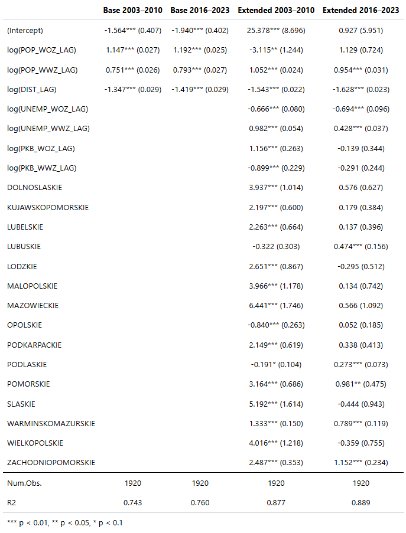

# Interregional Migration Model in Poland (2004–2023)

## What is this project?

This repository contains an econometric model estimating internal migration flows between Polish voivodeships across two periods: 2004–2011 and 2016–2023. The model is used to quantify the impact of key demographic and economic variables—such as population size, distance, unemployment rate, and GDP—on bilateral migration.

The estimation results are presented in the table below:

In the extended specification, fixed effects are also estimated to capture region-specific, unobservable migration attractiveness. The plots below visualize these fixed effects for both periods:

**Fixed effects (2004–2011):**  

**Fixed effects (2016–2023):**  

---

## How does it work?

The model is based on a log-linearized gravity equation of migration, estimated using OLS with fixed effects (LSDV estimator). Two variants of the model are implemented for each period:

- **Baseline model:**  
  Uses the logarithm of population in the sending and receiving regions (`ln(POP_WOZ)`, `ln(POP_WWZ)`) and the logarithm of distance between capitals (`ln(DIST)`).

- **Extended model:**  
  Adds the logarithm of unemployment and GDP in both regions (`ln(UNEMP)`, `ln(GDP)`) and dummy variables representing fixed effects for each receiving voivodeship.

All estimations were conducted separately for each time period to capture the changing dynamics of migration.

The time period split (2004–2011 and 2016–2023) was based on observed national trends: in both intervals, migration volumes were relatively similar and featured distinct phases of acceleration followed by decline.

---

## Why was this done?

The aim of this project was not to fully explain internal migration dynamics in Poland, but to empirically assess the relevance of several key explanatory variables. It also explores how these relationships evolved over time and to what extent unobservable regional characteristics influence migration flows.

This analysis supports policy thinking around regional development and migration-driven demographic change, while also suggesting that non-economic factors may be increasingly shaping migration decisions in recent years.
